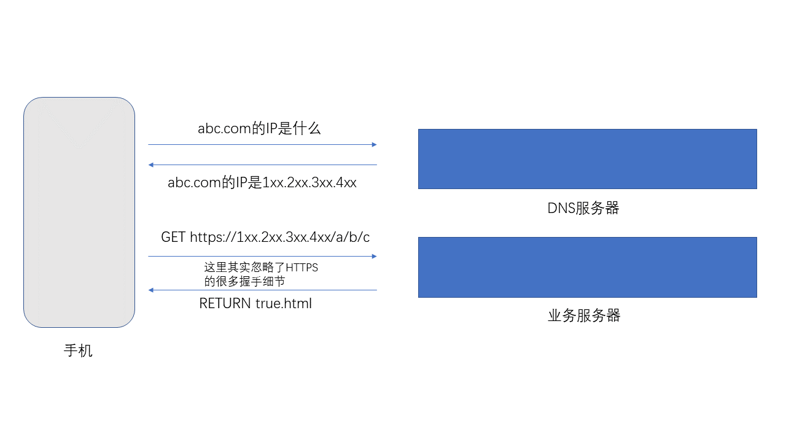
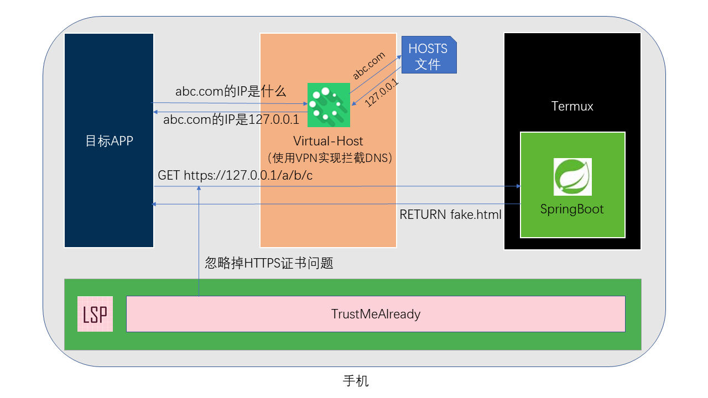
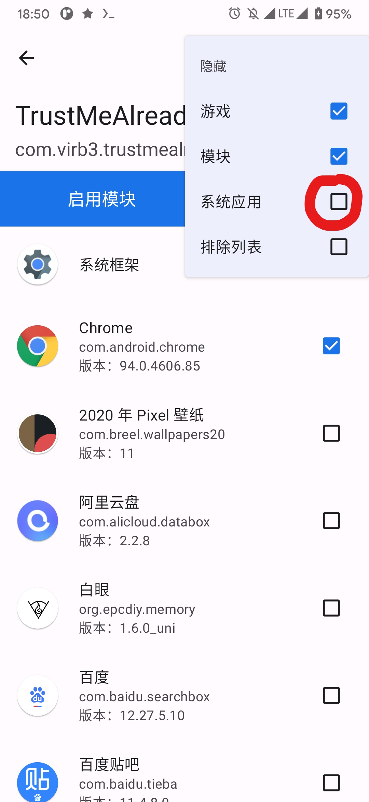
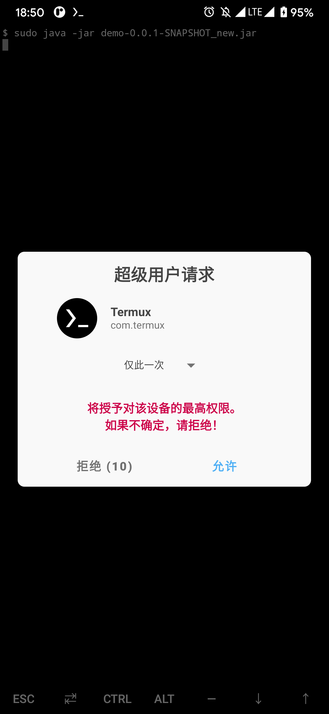
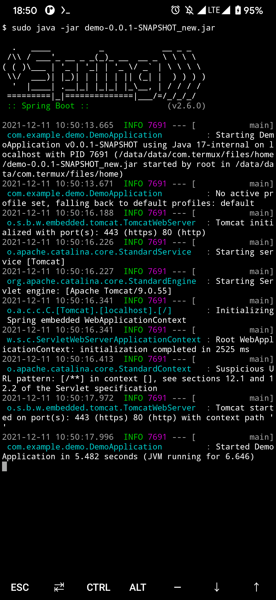
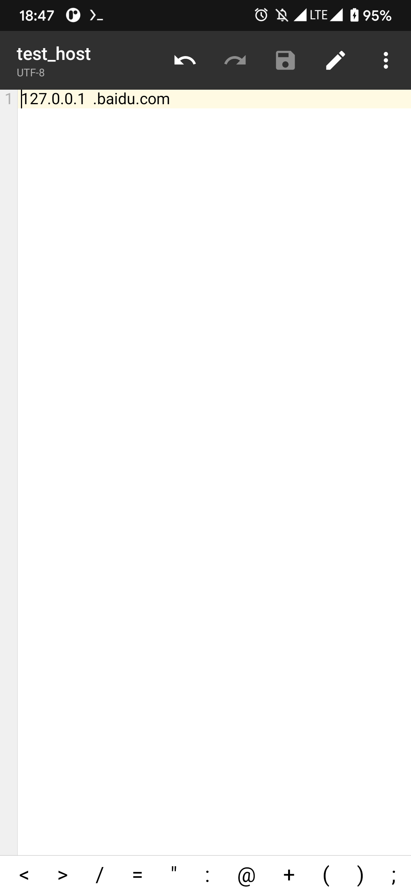
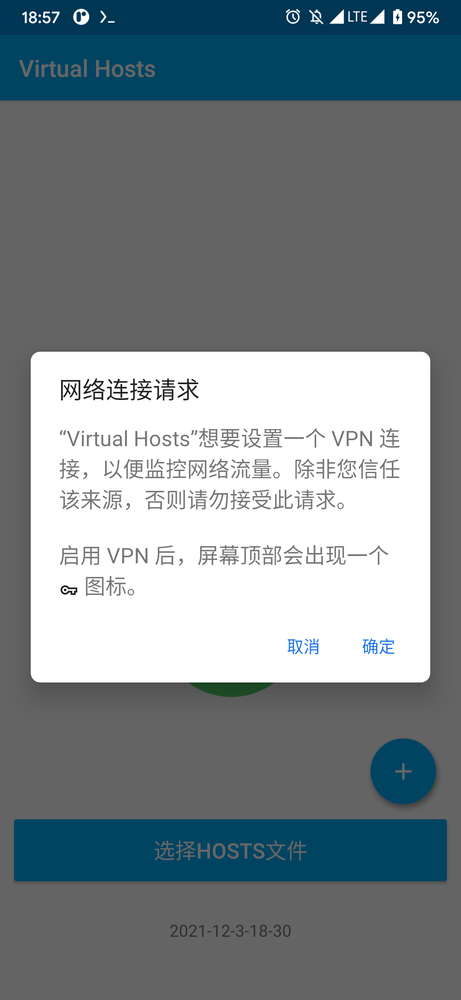

## 需求

其实自己给自己提的需求，但目前确实遇到了这样一个场景：

安卓手机，使用某特定 APP 访问 https 协议下的 abc.com，但期望的返回结果是一个自定义的页面

另外最好不要出现手机对 abc.com 的直接访问

需求难点如下：

1. 最好不要对此特定 APP 其进行侵入性操作（事实是我也不会
2. abc.com 使用 https 协议，https 协议天生对 MITM（中间人攻击）具有防御性

## 方案

针对两个需求难点，解决方案如下：

1. 使用 **Virtual-Host** 这个应用对指定域名进行 DNS 污染，使其指向本地 127.0.0.1 ， Virtual-Host 使用的是 VPN 来实现，这样理论上可以作用于此手机上的任何 APP

2. **手机ROOT掉**，使用 **Magisk + LSPosed + TrustMeAlready** 无差别忽略 SSL 证书异常，解决 https 协议的问题
3. 本地使用 **Termux + OpenJDK 17 + SpringBoot** 起一个 80 和 443 端口的服务器，除一些 js 和字体等静态内容直接返回外，对于其余 url 均返回自定义页面，这样可实现自定义页面的需求，并且启动时通过传参可实现页面部分内容自定义

图解如下：

### 原始请求流程图：



### 拦截后请求流程图：



其实就是把 DNS 服务器和业务服务器均放在了本地，使用 Virtual-Host 模拟 DNS 服务器，使用 SpringBoot 代替原来的业务服务器，从而实现页面自定义。

此方案目前在以下环境测试成功：

> 硬件型号: Redmi Note 8 Pro 
>
> Android版本: 11 
>
> ROM: PixelExperience_Plus_begonia-11.0-20210514-0310-OFFICIAL (当然，已ROOT)

此方案个人觉得其实并不完美，手机必须 ROOT，并且要启动三个组件之后才能完成需求

**所以如果各路大神有更好的想法，欢迎直接提 issue 讨论**

另外，本仓库开源的是 SpringBoot 部分，其余的组件也均是开源的，地址如下

> Virtual-Host: https://github.com/x-falcon/Virtual-Hosts/releases/tag/2.1.0
>
> TrustMeAlready: https://github.com/ViRb3/TrustMeAlready/releases/tag/v1.11

（Termux 和 LSPosed 当然也是开源的，这两个比较方便下载，网上也有一堆教程，不赘述）

## 启动流程及效果

我们假装要把 baidu.com 换成自定义页面

1. 安装 Magisk + LSPosed + TrustMeAlready，这个流程网上有很多，TrustMeAlready 链接上面已贴出

   注意 LSPosed 需要指定目标应用，即点击 **模块 ->  TrustMeAlready -> 启用模块** 之后，要把目标应用勾上，这样才能生效，另外建议启用模块之后把目标应用重启一次，否则可能连不上网

   演示使用 Chrome 浏览器，目前 Chrome 浏览器被我的安卓 11 认为是系统应用，所以需要点击勾选应用界面的 **右上角的三个点 -> 隐藏 -> 系统应用**，把系统应用的勾去掉就好

   

2. 安装 Termux，为了下载速度快一些，可以配置清华镜像，这一步网上也有很多教程

3. 进入 Termux，安装 jdk，我参考的是 https://www.bilibili.com/read/cv12555128 的方法一，目前（2021-12-10） Termux 的包里面已经有 openjdk-17了，基本上就是直接一行命令就完事

   ```bash
    pkg install openjdk-17 -y
   ```

4. 配置 Termux 访问存储，Termux 内运行 termux-setup-storage 即可

   ```
   termux-setup-storage
   ```

5. 把本项目 [Release](https://github.com/eddlez/demo/releases/download/0.0.1/demo-0.0.1-SNAPSHOT_new.jar) 页面的 jar 包传至手机，保证 Termux 内可以访问到它

6. 运行 sudo java -jar demo 0.0.1-SNAPSHOT_new.jar 即可启动，此时可以通过传参实现部分页面内容的自定义。完整的参数列表如下

   ```bash
   sudo java -jar demo-0.0.1-SNAPSHOT_new.jar --id=12345678 --name=zzz --set=location --pass_tip=false --type=normal
   ```

   “杜撰”了五个参数 id，name，set，pass_tip，type。在 Termux 内测试可支持中文，不过一般常用的就是 id，name，set 这三个参数（这句话好怪哦），此 demo 中也只会把 id，name，set 展示在网页上

   另外，**使用 sudo 会提示 ROOT 权限请求**，这是因为 Linux 中 80 和 443 端口的使用本身就需要超级用户权限

   

   等到控制台打印了 Started Demo Application in XXX 的一行提示之后，说明 SpringBoot 应用启动成功了

   

7. 安装 Virtual-Host，链接上面已贴出，安装完之后需要自己建一个文件，里面只写一行

   ``` 
   127.0.0.1 baidu.com
   ```

   建议放在比较容易找到的位置，比如 download 文件夹

   

8. 打开 Virtual-Host 的中间的大按钮，第一次启动应该会让你选一个文件，选择我们刚才创建的那个就行，另外第一次启动会请求 VPN 权限，确定即可。

   

9. 准备工作差不多了，可以打开 Chrome 浏览器，访问 baidu.com，此时可见页面已经被替换了

   

## 如果需要替换域名

目前仓库的证书文件 baidu.p12 () 中的 SAN (Subject Alternative Name) (使用者可选名称) 信息是

> localhost 
> 127.0.0.1 
> *.baidu.com

如果需要替换域名，比如打算拦截 google.com ，那么除了需要更改 Virtual-Host 的配置文件外，还需要重新签一份 SAN 信息包含 google.com 的证书，来替换目前仓库中的 baidu.p12 ，然后重新编译打包 jar 包

生成证书的方法可参考

> https://blog.csdn.net/halozhy/article/details/121888033

## 后记

目前这个方案过于繁琐，而且必须有 TrustMeAlready 的加持才能解决 SSL 问题。

有时想过能不能魔改 Virtual-Host，在里面加一个能够响应 SSL 连接的小服务器？

另外我这个也许不算是严格的 MITM 中间人攻击，但不得不感叹，HTTPS 在大部分场景下还是很安全的

反正如果有什么想说的欢迎开 issue 讨论吧
